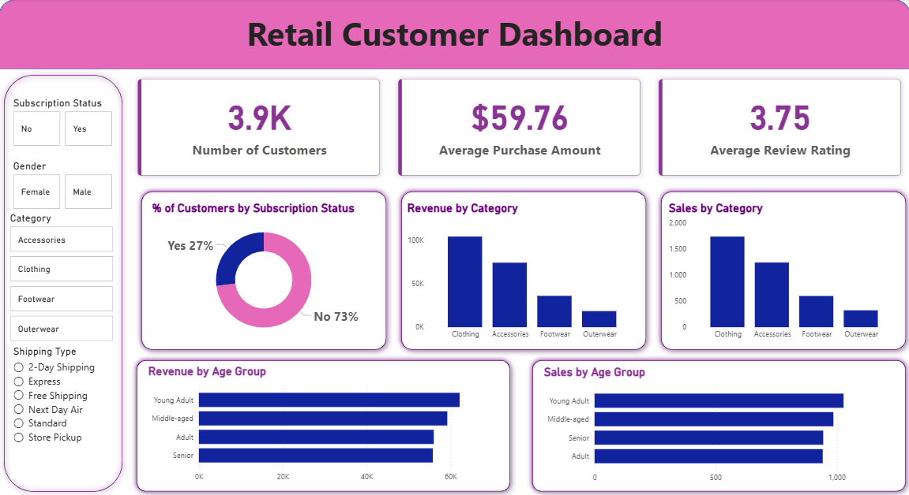
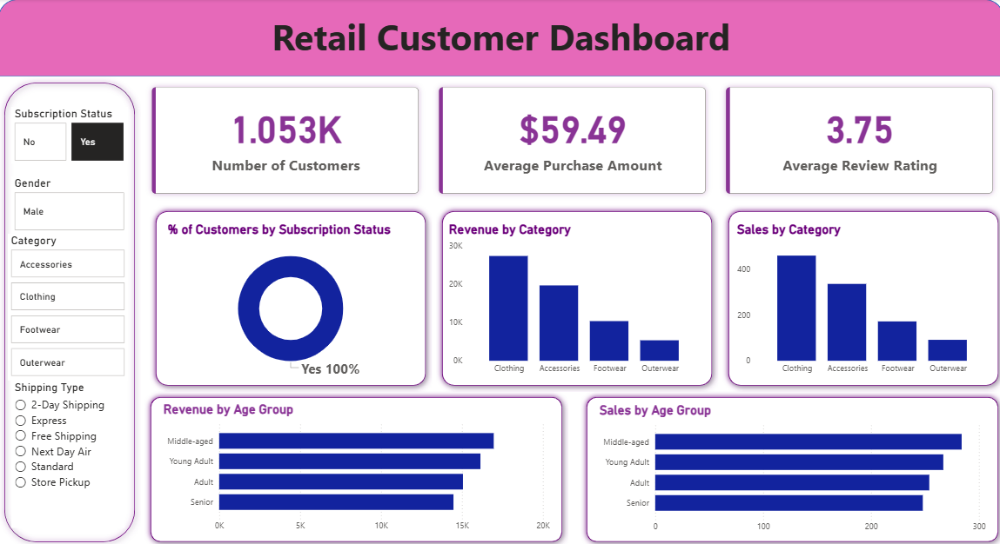
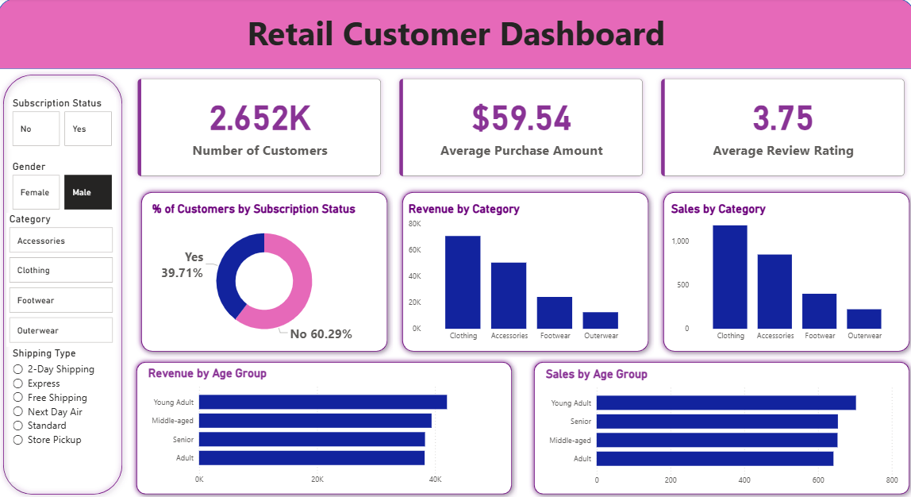
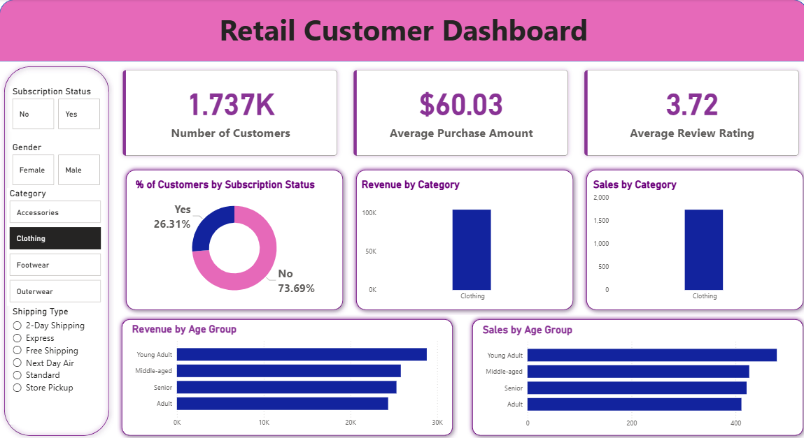
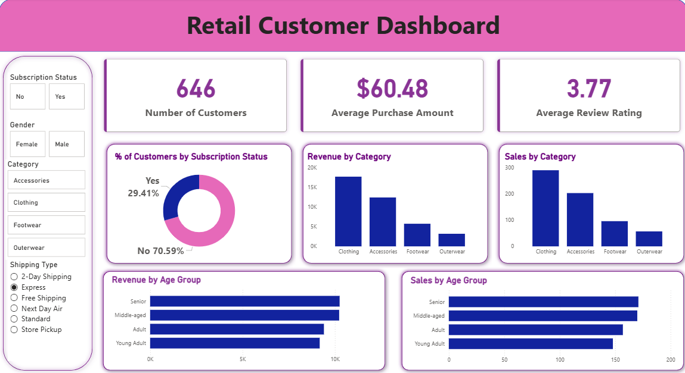

## Retail Customer Shopping Analysis

Python · SQL · Power BI · DAX

A retail analytics project examining 3,900 customer transactions across 18 variables to uncover purchasing patterns, top-performing regions, and revenue-driving product categories.


## Business Problem

A retail business required customer behaviour analysis to identify purchasing trends, high-performing product categories, and regional sales opportunities for business optimization.


## Project Overview

This project performs end-to-end customer behavior analysis on a retail shopping dataset — from data cleaning and EDA in Python to SQL-based segmentation queries to a Power BI dashboard — providing actionable insights for inventory planning, regional marketing, and customer targeting.


## Key Insights Uncovered

- Average purchase amount: $59.77 per transaction across all customers
- Montana is the highest-performing state by total sales value
- Clothing is the #1 revenue category — over 1,700 items purchased
- Subscription customers show higher average order values than non-subscribers
- Male customers account for slightly higher transaction frequency than female customers


## Installation & Setup

To install all required dependencies, run the following command:

```bash
pip install -r requirements.txt
```


## Project Structure

│── customer_shopping_behavior.csv          ← Raw dataset (3,900 records) |

│── Customer_Shopping_Behavior_Analysis.ipynb  ← Full EDA + visualizations |

│── customer_behavior_sql_queries.sql       ← SQL KPI queries |

│── customer_behavior_dashboard.pbix        ← Power BI dashboard |

│── README.md |


## Dataset Overview - customer_shopping_behavior.csv

### Field - Description

Customer ID - Unique identifier |

Age - Customer age |

Gender - Male / Female |

Item Purchased - Product name |

Category - Clothing, Footwear, Accessories, Outerwear |

Purchase Amount (USD) - Transaction value |

Location - US State |

Season - Spring / Summer / Fall / Winter |

Subscription Status - Yes / No |

Payment Method - Card type used |

Shipping Type - Standard, Express, etc. |


## Key Performance Indicators (KPIs)

### KPI - Value |

#### Revenue KPIs

Total Revenue - $233,081 |

Total Customers - 3,900 |

Avg Purchase Amount - $59.76 |

Max Single Purchase - $100 |

Min Single Purchase - $20 |

Avg Review Rating - 3.75 - 5.00 |

#### Revenue by Category

Category | Total Revenue | Avg Purchase | Transactions |

Clothing | $104,264 | $60.03 | 1,737 |

Accessories | $74,200 | $59.84 | 1,240 |

Footwear | $36,093 | $60.26 | 599 |

Outerwear | $18,524 | $57.17 | 324 |

#### Revenue by Season

Season - Total Revenue |

Fall - $60,018 |

Spring - $58,679 |

Winter - $58,607 |

Summer - $55,777 |


## Dashboard Preview

Home


Subscription


Gender


Category


Shipping



## Sample SQL Queries Used

sql

-- Average purchase amount by category

SELECT
    category,
    ROUND(AVG(purchase_amount_usd), 2) AS avg_purchase,
    COUNT(*) AS total_transactions
FROM retail_customers
GROUP BY category
ORDER BY avg_purchase DESC;

-- Top 5 states by total revenue

SELECT
    location,
    SUM(purchase_amount_usd) AS total_revenue,
    COUNT(*) AS transactions
FROM retail_customers
GROUP BY location
ORDER BY total_revenue DESC
LIMIT 5;

-- Subscription vs non-subscription spend comparison

SELECT
    subscription_status,
    ROUND(AVG(purchase_amount_usd), 2) AS avg_spend,
    COUNT(*) AS customer_count
FROM retail_customers
GROUP BY subscription_status;


## Tech Stack

### Tool - Purpose 

Python (Pandas, NumPy) - Data cleaning & preprocessing , (Matplotlib, Seaborn) - EDA visualizations |

SQL - Customer segmentation queries |

Power BI + DAX - Interactive dashboards |

Jupyter Notebook - Analysis environment |


## Business Impact

Simulated customer segmentation and regional sales intelligence for retail decision-making. |

Improved visibility into customer purchasing patterns and product performance. |


## How to Run

### 1. Clone the Repository
```bash
git clone https://github.com/BeHarsha/Retail_Customer_Shopping_Analysis
cd Retail_Customer_Shopping_Analysis
```

### 2. Install Python Dependencies
```bash
pip install pandas numpy matplotlib seaborn
```

### 3. Run the Python Analysis
Launch Jupyter Notebook and open `Customer_Shopping_Behavior_Analysis.ipynb` to explore the dataset and run the full analysis:
```bash
Customer_Shopping_Behavior_Analysis.ipynb
```

### 4. Run the SQL Queries
Open `customer_behavior_sql_queries.sql` in your preferred SQL environment (MySQL Workbench, pgAdmin, DBeaver, or any compatible SQL client).

Import `customer_shopping_behavior.csv` into your database, then execute the queries to perform data extraction, aggregation, and transformation.

### 5. View the Power BI Dashboard
Open `customer_behavior_dashboard.pbix` in Power BI Desktop to explore the interactive visualizations covering customer segments, purchase trends, and key retail metrics.


## Author

Bethineedi Deva Harsha
- [LinkedIn](https://www.linkedin.com/in/bethineedi-deva-harsha-3933aa2a9)
- [GitHub](https://github.com/BeHarsha)
- harsha.fieldmaster@gmail.com
